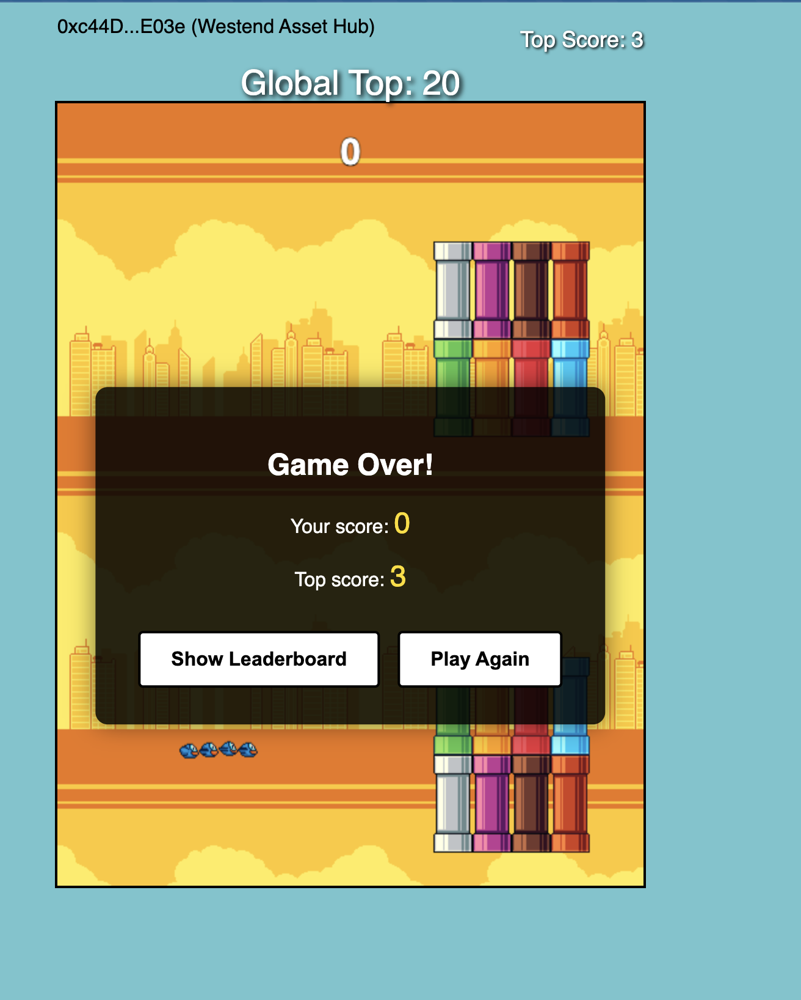
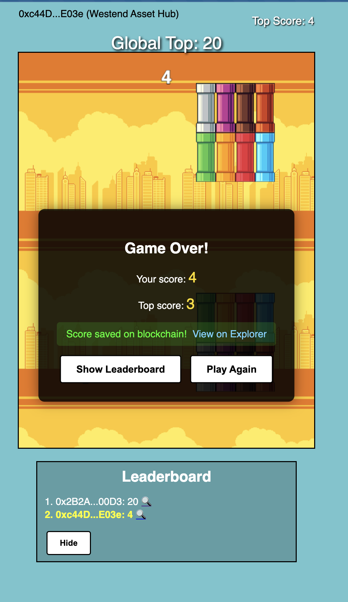

# Flappy Bird on Chain

> A blockchain-powered version of the classic Flappy Bird game with on-chain high scores and achievements.

## Demo & Media

### Video Demo
[](https://www.loom.com/share/PLACEHOLDER_LOOM_ID)

### Screenshots



### Presentation
[View Our Canva Presentation](https://www.canva.com/design/PLACEHOLDER_CANVA_ID/view)

## Problem Statement

Traditional gaming platforms offer limited ownership of in-game achievements and lack transparency in score verification. Players have no true ownership of their gaming accomplishments and data privacy concerns persist.

## Solution

FlappyChain transforms the nostalgic Flappy Bird experience by leveraging Polkadot's Asset Hub to store high scores and achievements directly on-chain. This creates a transparent, tamper-proof gaming ecosystem where:

- Players truly own their gaming achievements
- Scores are publicly verifiable
- The gaming experience remains decentralized and censorship-resistant
- Community-owned leaderboards create friendly competition

## Technical Implementation

### Smart Contract
The project uses a custom smart contract deployed on Polkadot Asset Hub that:
- Stores and validates player high scores
- Implements an ownership verification system
- Provides public access to global leaderboards
- Uses gas-efficient storage patterns

```solidity
// Key smart contract functionality:
function submitScore(uint256 newScore) public {
    require(newScore > scores[msg.sender], "New score must be higher than previous score");
    scores[msg.sender] = newScore;
    emit ScoreUpdated(msg.sender, newScore);
}
```

### Technology Stack
- **Blockchain**: Polkadot Asset Hub
- **Smart Contract Language**: Solidity 0.8.20
- **Frontend**: HTML5, CSS3, JavaScript
- **Web3 Integration**: ethers.js for wallet connection and contract interaction

### Polkadot-Specific Features
This project specifically leverages these Polkadot features:
- **Asset Hub's EVM Compatibility**: Providing a secure environment for Solidity contracts
- **Cross-Chain Potential**: Future versions can interact with other parachains
- **Low Gas Fees**: Making microtransactions viable for gaming achievements
- **Scalability**: Supporting many concurrent players without performance degradation


## How to Play

1. Connect your EVM-compatible wallet (MetaMask recommended) to Polkadot Asset Hub
2. Navigate to the game interface
3. Click or tap to make the bird flap and avoid obstacles
4. Upon game over, your score is submitted to the blockchain if it's your new personal best
5. View the global leaderboard to see how you compare to other players

## Technical Details for Running the Project

### Network Configuration
Add Polkadot Asset Hub to your wallet with these settings:
- **Network Name**: `Westend Asset Hub`
- **RPC URL**: `https://westend-asset-hub-eth-rpc.polkadot.io`
- **Chain ID**: `420420421`
- **Currency Symbol**: `WND`
- **Block Explorer**: `https://blockscout-asset-hub.parity-chains-scw.parity.io/`

### Contract Deployment
Our smart contract is deployed at:  
`0x350108263CAf6D6b3fa9c557A12dda510FA64A15`

[View on Block Explorer](https://blockscout-asset-hub.parity-chains-scw.parity.io/address/0x350108263CAf6D6b3fa9c557A12dda510FA64A15)

## Team

Our diverse team consists of blockchain enthusiasts with expertise in game development, smart contract development, and web design. See our [presentation](https://www.canva.com/design/PLACEHOLDER_CANVA_ID/view) for more details about our backgrounds.

## Open Source Commitment

This project is fully open source under the MIT License. We are committed to maintaining this project as a community resource and welcome contributions from developers interested in blockchain gaming.

## Future Development

- Cross-chain trophy NFTs for top performers
- Integration with Polkadot's identity system for verified player profiles
- In-game currency and customization options
- Tournament functionality with smart contract-enforced rules

---

